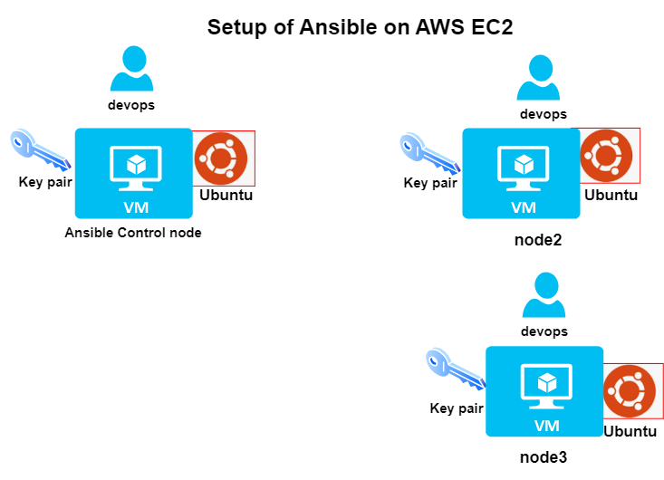
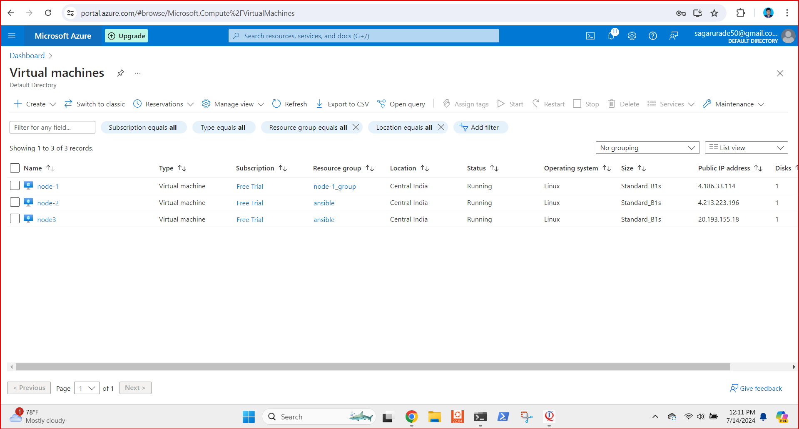
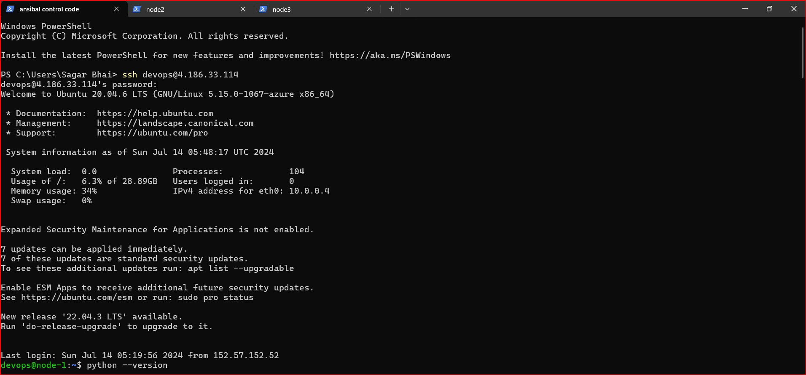
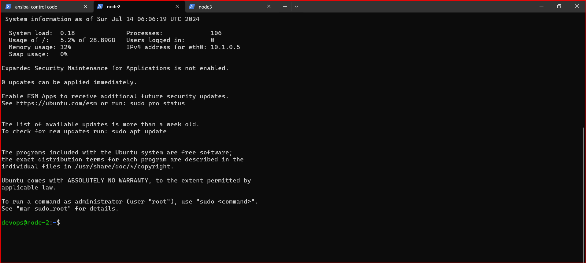
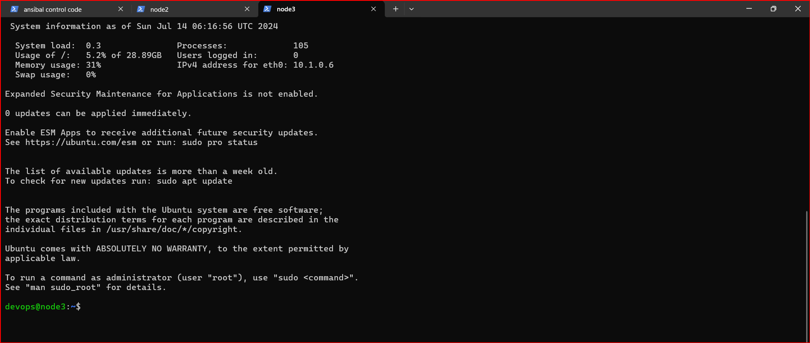

Installing Ansible on Azure VM 

1) login to Microsoft azure free tire account.

2) Create 3 Virtual Machine name node 1 (Ansible control node ) node2, node3.
   1) Create a key pair
   2) Select the ubuntu Operating System for all 3 nodes.
   3) Add username and password then create vm.

3) Open any terminal every vm has there one ip address to connect , copy the node1 address past it to terminal to connect command

   '''
    ssh username@publicip of node1
 
   '''
  1) With same command ssh node2 username node2 public ip connect to node2.

  2) same process to node3

  
  
  

4) After login vm in terminal install Ansible to node 1 with the help of this command and past it .

 '''
 sudo apt update
 sudo apt install software-properties-common
 sudo add-apt-repository --yes --update ppa:ansible/ansible
 sudo apt install ansible -y

 '''

5) it take some time to install gave the permission -y if it is asking.
6) To conform that type ansible --version 

7) To connect the node2 and node3
  Check if the ansible can communicate with node-2 and node-3 
  Create a inventory.
  Create a file called as host with the following entries
 '''
 node2 ipaddress
 node3 ipaddress
 '''
to check  nodes are connected are not ansible has a command to check connectivity
''' ansible -m ping --ask-pass -i hosts all '''

8) In this way you can install ansible on any vm using this steps 

After installing and connecting to all node you can configure by one node you cam manage key pair or password ,
what you install on ansible control node you can see same install on other nodes also 
to control Virtual Machine at a time you can use Ansible .

Thank you...

